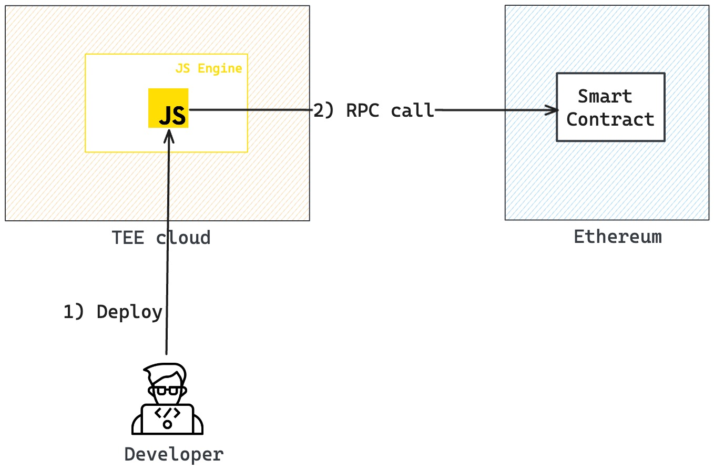

# Jtee Template Project

Starter template for running Javascript application on Phala TEE cloud.

With the command tool `jtee`, you can easily deploy and run the application, and interact 
with smart contracts deployed on another blockchain through RPC. For example, use [ethers](https://docs.ethers.org/)
to interact with the smart contract deployed on Ethereum.

## Project Overview



1. The TEE cloud is composed of SGX devices registered on the Phala blockchain.
2. Your Javascript application under 'app/*' will be packed into a single file using Webpack.
3. When you run the application, the packed file will be uploaded to the WASM VM and then run by the Javascript Engine.
4. You can interact with the smart contract deployed on another blockchain through RPC in your Javascript application. TEE can guarantee the security of the private key which generated for your application specifically.

## Prerequisites

1. Node version >= v18.14
2. Have npx installed

## Quick Start

- You should have created a new jtee project with the following command, so free to skip this step.

```bash
$ npx jtee@latest new <my-jtee-project>
```

- Deploy the engine

To run Javascript on the Phala TEE cloud, you need to deploy a Javascript engine first.
The purpose of this engine is to 1) execute the JavaScript code and 2) inject a Javascript `jtee` object
that you can use in your script.

Before running the deploy command, you need to prepare a Phala blockchain account with enough balance and the node endpoint
in the .env file like below in your project root directory.

```bash
PHALA_ACCOUNT_URI="elegant capable test bar uncover comic speed cabin tattoo company cabin layer"
# PoC6 Testnet
PHALA_RPC=wss://poc6.phala.network/ws
```

Then, execute the following command to deploy the engine:

```bash
$ npx jtee@latest deploy
```

You finally will get the contract ID if everything goes well

```bash
✅ Contract uploaded & instantiated: 0x9caa44c6686d1c1e17b4885a96faa6d055055930a248531950b0c11217cebf51
```

- Run the project on the Phala TEE cloud

Now, you are ready to run your application on the Phala TEE cloud. By issuing the following command, run the code located in `app/index.js` on Phala TEE could:

> Note: You don't need to deploy the engine every time you run the application, you just need to deploy once unless you want to change the deployer account or you want to upgrade the engine when `jtee` has a new version released.

```bash
$ npx jtee@latest run
```

If everything goes well, you will see the following output:

```bash
Execution result: {
 "ok": {
 "ok": {
 "null": null
 }
 }
}
```

> Note: only the engine deployer, e.g. the account derived from the URI you provided in the .env file has permission to run Javascript code on the TEE cloud.
